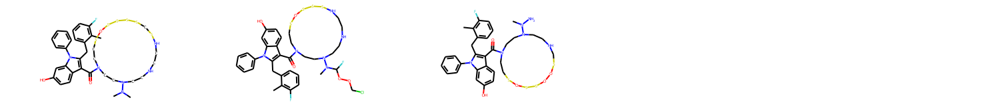
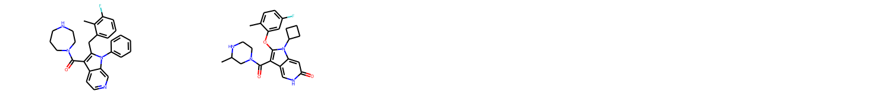

# Impact of applicability domains to generative artificial intelligence 
Repository for the code associated with the paper Impact of applicability domains by Maxime Langevin et al.
This code reproduces the results found in the paper "Impact of applicability domains to generative artificial intelligence".
The quality of generated molecules is a crucial aspect of generative algorithms for molecular design. Yet, it was often overlooked, and only 
recently highlighted explicitly in publications (see for instance the work of Renz *and al*, available 
at: https://www.sciencedirect.com/science/article/pii/S1740674920300159). In this work, we empiriclly evaluate various applicability domain definitions to constrain generative 
algorithms for molecular design. <br/>
We show that defining a good applicability domain has a significant imapct on the quality of generated compounds.

When defining a bad applicability domain:



When defining a good applicability domain:



## Code 

### Credits

This code relies on the guacamol baselines, an open-source implementation of various generative models for molecular design. <br/>
We use the same settings that in https://github.com/ml-jku/mgenerators-failure-modes for the lstm.<br/>
We also use the quality filters compiled from the ChEMBL by Pat Walters and available at: https://github.com/PatWalters/rd_filters <br/>
We thank the authors of those works for their high quality, open-source softwares.

### Installation

The RDKit is a requirement for the code, and installation guidelines can be found at https://www.rdkit.org/docs/Install.html.
For the other dependencies: 

```
pip install -r requirements
```
### Running the experiments 

To reproduce our results for a given dataset (given as a csv file in the datasets folder):
```
python run.py --nruns 10 --base_results results/dataset_folder --dataset datasets/dataset.csv
```
The notebooks generate all images and results used in the paper for the different datasets.
